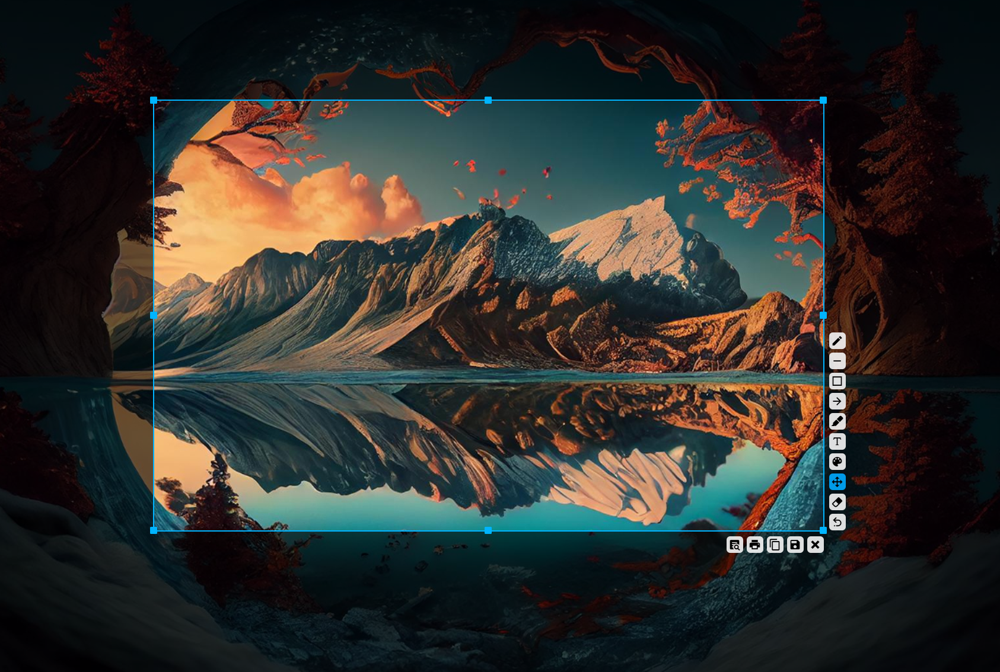
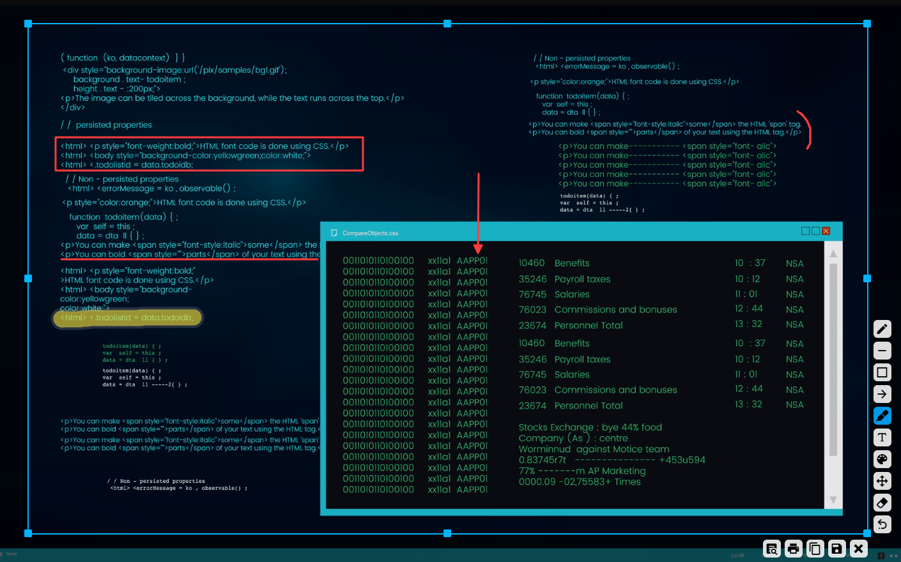
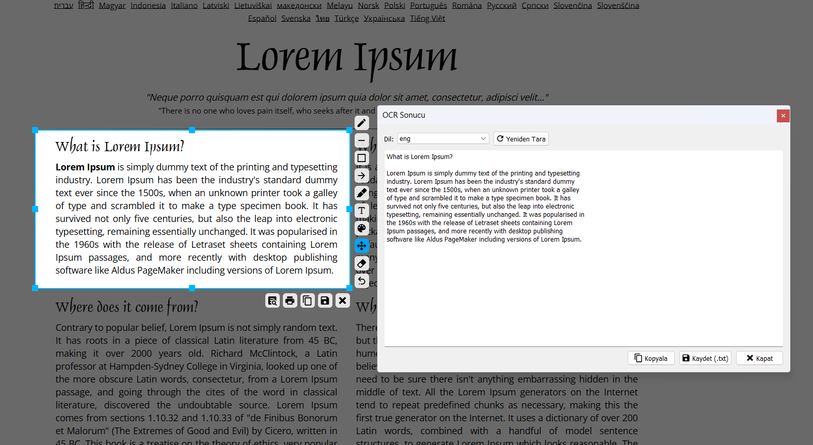

  

  <h1>SnapRead</h1>
  
Free and simple desktop screen capture and annotation tool.

  

    <a href="#-english">English</a>
    ·
    <a href="#-türkçe">Türkçe</a>
  

---

## English

**Snap Read** is a lightweight and fast screen capture tool, designed as a practical alternative to Lightshot.  
Capture any region of your screen, highlight with a marker (visible on light/dark backgrounds), add arrows, lines, text, and save or copy instantly.

### ✨ Features

* **Screen Capture:** Select an area, window, or capture the entire screen.
* **Annotation Tools:** Highlighter (visible on light/dark), arrows, lines, boxes, free drawing, and text.
* **Undo / Redo:** Quickly revert or redo your edits (Ctrl+Z / Ctrl+Y).
* **Export Options:** Copy to clipboard, save as PNG/JPG, or print.
* **Lightweight & Offline:** Works fast, uses minimal resources, and runs fully offline.

### 🖼️ Screenshots

| Capture & Highlight | Annotate with Text & Arrows | OCR Example |
| :-----------------: | :-------------------------: | :-------------------------: |
|  |  |  |

### 🚀 Download

You can download the latest version safely from the link below. The setup file (`.exe` or `.rar`) allows you to install the program easily.

[**>> Download the Latest Version <<**](https://github.com/mnevres/snap-read/releases/latest)

## Feedback and Support

Your feedback, suggestions, or any bugs you encounter are very valuable to me. You can use one of the following methods to provide feedback:

* **For General Feedback and Suggestions:**  
  Use the [contact form](https://nevresoglu.net/programs#contact) on my website.

* **For Bug Reports and Technical Requests (Recommended):**  
  Report bugs with details or request features in the "Issues" section of the project's GitHub page:

  * [» SnapRead Issues Page](https://github.com/mnevres/snap-read/issues)

---

## 🇹🇷 Türkçe

**SnapRead**, Lightshot tarzı hafif ve hızlı bir ekran yakalama aracıdır.  
Seçili alanın ekran görüntüsünü alabilir, fosforlu kalem ile vurgulama yapabilir (beyaz/koyu zeminde net görünür), ok, çizgi, kutu, metin gibi araçlarla düzenleyebilir ve kaydedebilirsiniz.

### ✨ Özellikler

* **Ekran Yakalama:** Belirli bir alanı, pencereyi veya tüm ekranı yakalayın.
* **Düzenleme Araçları:** Fosforlu kalem, ok, çizgi, kutu, serbest çizim ve metin ekleme.
* **Geri Al / İleri Al:** Yaptığınız düzenlemeleri hızlıca geri alın veya yineleyin (Ctrl+Z / Ctrl+Y).
* **Dışa Aktarma Seçenekleri:** Panoya kopyalayın, PNG/JPG olarak kaydedin veya yazdırın.
* **Hızlı & Çevrimdışı:** Hafif çalışır, sistem kaynaklarını yormaz, tamamen çevrimdışı çalışır.

### 🖼️ Ekran Görüntüleri

| Yakalama & Fosforlu Kalem | Metin & Ok ile Düzenleme | Resimden metine dönüştürme (OCR) |
| :-----------------------: | :----------------------: | :----------------------: |
|  |  |  |

### 🚀 İndirme

Programın en güncel sürümünü aşağıdaki bağlantıdan güvenle indirebilirsiniz.  
Kurulum dosyası (`setup.exe` veya `.rar`), programı bilgisayarınıza kolayca kurmanızı sağlar.

[**>> En Son Sürümü İndir <<**](https://github.com/mnevres/MN-SnapRead/releases/latest)

---

### 👨‍💻 Geliştirici

**Mehmet Nevresoğlu**

* **Website:** [nevresoglu.net](https://nevresoglu.net)
* **LinkedIn:** [linkedin.com/in/mehmet-nevresoglu-bb44341a/](https://www.linkedin.com/in/mehmet-nevresoglu-bb44341a/)

If you’d like to support the development of these free tools:  

